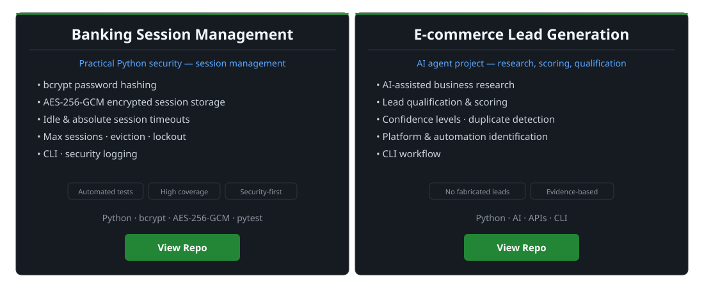

<picture>
  <source media="(prefers-color-scheme: dark)" srcset="assets/banner-dark.svg">
  <source media="(prefers-color-scheme: light)" srcset="assets/banner-light.svg">
  
</picture>

---

## About Me

I completed my FSc at Islamia College Peshawer. I'm admitted to BS Computer Science at Sarhad University. Alongside my degree, I'm learning Agentic AI Engineering part-time — AI agents, automation, and Python — and practicing it by building projects. After my BS Computer Science, I plan to pursue an MS in Data Science.

Personal interest: trading and financial markets.

---

## Education

| | Education | Status |
|---:|---|---|
| 1 | FSc, Islamia College Peshawer | Completed |
| 2 | BS Computer Science, Sarhad University | Admitted / Current |
| 3 | MS Data Science | Planned after BS Computer Science |

---

## Current Focus

- Python and software engineering fundamentals
- Agentic AI Engineering — part-time learning alongside my degree
- AI agents and agent frameworks — OpenAI Agents SDK, Google ADK, MCP
- AI automation workflows and LLM applications
- Spec-driven development and testing with pytest

---

## Tech Stack

| Category | Tools |
|---|---|
| **Languages** | <picture><source media="(prefers-color-scheme: dark)" srcset="https://skillicons.dev/icons?i=python&theme=dark"><source media="(prefers-color-scheme: light)" srcset="https://skillicons.dev/icons?i=python&theme=light"></picture> |
| **AI / Agents** |       |
| **Automation** |  |
| **Developer Tools** | <picture><source media="(prefers-color-scheme: dark)" srcset="https://skillicons.dev/icons?i=git,github,vscode&theme=dark"><source media="(prefers-color-scheme: light)" srcset="https://skillicons.dev/icons?i=git,github,vscode&theme=light"></picture> |
| **Testing** |  |

---

## Featured Projects

<picture>
  <source media="(prefers-color-scheme: dark)" srcset="assets/projects-dark.svg">
  <source media="(prefers-color-scheme: light)" srcset="assets/projects-light.svg">
  
</picture>

**Banking Session Management** — a practical Python software engineering project. Password hashing, encrypted session storage, session timeouts, session limits, account lockout, and security logging, all covered by automated tests.

[View repository](https://github.com/mkx-hub/Banking-Session-Management)

**E-commerce Lead Generation** — an AI agent project. Research-assisted lead qualification with scoring, confidence levels, and duplicate detection. Results are evidence-based — no fabricated data.

[View repository](https://github.com/mkx-hub/E-commerce-Lead-Generation)

---

## What I'm Learning

- Agentic AI Engineering
- OpenAI Agents SDK
- Google ADK
- MCP
- AI automation workflows
- Multi-agent systems
- Spec-driven development
- Testing with pytest

---

## Engineering Principles

1. Build before claiming expertise.
2. Test what I build.
3. Never fabricate data.
4. Learn by implementing.
5. Improve through iteration.

---

## Journey

<picture>
  <source media="(prefers-color-scheme: dark)" srcset="assets/journey-dark.svg">
  <source media="(prefers-color-scheme: light)" srcset="assets/journey-light.svg">
  
</picture>

---

## Connect

 

<picture>
  <source media="(prefers-color-scheme: dark)" srcset="assets/footer-dark.svg">
  <source media="(prefers-color-scheme: light)" srcset="assets/footer-light.svg">
  
</picture>

